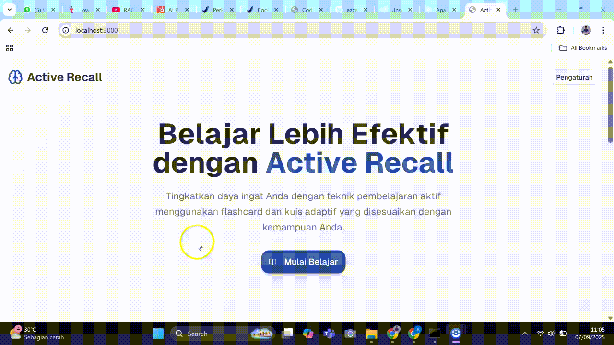

# Study with Active Recall LLM App

Aplikasi pembelajaran berbasis Active Recall yang menggunakan AI untuk membantu Anda belajar lebih efektif. Aplikasi ini mendukung upload PDF, ekstraksi URL, dan input teks langsung untuk membuat flashcard dan kuis adaptif.

---

## 📸 Demo

### Halaman Utama



### Flashcard Mode


### Quiz Mode


---

## ✨ Fitur Utama

* 🧠 **Active Recall Learning** – Teknik pembelajaran terbukti efektif
* 📄 **Multi-format Input** – PDF, URL, dan teks langsung
* 🤖 **AI-Powered** – Menggunakan Gemini API untuk generate pertanyaan
* 🎯 **Adaptive Quiz** – Kuis yang menyesuaikan dengan kemampuan Anda
* 📊 **Progress Tracking** – Lacak kemajuan dan streak harian
* 🇮🇩 **Bahasa Indonesia** – Interface lengkap dalam Bahasa Indonesia
* 🎨 **Modern UI** – Desain yang bersih dan responsif

---

## 🚀 Cara Menjalankan Aplikasi

### Prasyarat

Pastikan Anda sudah menginstall:

* **Node.js** (versi 20.19 atau lebih tinggi) – [Download di sini](https://nodejs.org/)
* **npm** (biasanya sudah termasuk dengan Node.js)
* **Git** – [Download di sini](https://git-scm.com/)

### Langkah Instalasi

1. **Clone Repository**

   ```sh
   git clone https://github.com/azzandwi1/study-with-active-recall-llm-app.git
   cd study-with-active-recall-llm-app
   ```

2. **Install Dependencies**

   ```sh
   npm install
   ```

3. **Setup Environment Variables**
   Buat file `.env.local` di root directory:

   ```sh
   # Backend API URL (ganti dengan URL backend Anda)
   NEXT_PUBLIC_BACKEND_URL=http://localhost:8000

   # Tambahkan environment variables lain sesuai kebutuhan backend
   ```

4. **Jalankan Development Server**

   ```sh
   npm run dev
   ```

5. **Buka di Browser**
   [http://localhost:3000](http://localhost:3000)

---

## Setup API Key

1. Buka [http://localhost:3000/settings](http://localhost:3000/settings)
2. Masukkan **Gemini API Key** Anda
3. Baca dan setujui **Peringatan Privasi Data**
4. Klik **Simpan Pengaturan**

> **Cara mendapatkan Gemini API Key:**
>
> 1. Kunjungi [Google AI Studio](https://makersuite.google.com/app/apikey)
> 2. Login dengan akun Google
> 3. Buat API Key baru
> 4. Copy dan paste ke aplikasi

---

## 📖 Cara Menggunakan

### 1. Ingest Konten

* Kunjungi halaman **Ingest** (`/ingest`)
* Pilih salah satu metode:

  * **Upload PDF** – Drag & drop file PDF
  * **Input URL** – Masukkan link artikel/website
  * **Input Teks** – Paste teks langsung

### 2. Mulai Belajar

* Setelah konten diproses, klik **Mulai Belajar**
* Pilih mode pembelajaran:

  * **Flashcard** – Review kartu dengan flip animation
  * **Quiz** – Jawab pertanyaan (5/10/15 soal)

### 3. Tracking Progress

* Lihat **Progress Ring** untuk kemajuan harian
* **Review Calendar** menampilkan aktivitas pembelajaran
* **Streak Counter** untuk motivasi konsistensi

---

## 🛠️ Teknologi yang Digunakan

* **Frontend:** Next.js 14, React 19, TypeScript
* **Styling:** Tailwind CSS v4, shadcn/ui
* **AI Integration:** Gemini API
* **Animations:** CSS Transitions & Transforms
* **Icons:** Lucide React

---

## 🔧 Konfigurasi Backend

Aplikasi ini membutuhkan backend API yang menyediakan endpoint:

* `POST /api/v1/ingest` – Upload dan proses konten
* `GET /api/v1/flashcards` – Ambil flashcards
* `POST /api/v1/quiz/generate` – Generate quiz
* `POST /api/v1/quiz/evaluate` – Evaluasi jawaban

Pastikan backend Anda berjalan di URL yang sesuai dengan `NEXT_PUBLIC_BACKEND_URL`.

---

## 🐛 Troubleshooting

### Error: "API Key tidak ditemukan"

* Pastikan Anda sudah mengisi API Key di halaman Settings
* Periksa apakah API Key valid dan aktif

### Error: "Backend tidak dapat diakses"

* Periksa apakah `NEXT_PUBLIC_BACKEND_URL` sudah benar
* Pastikan backend API sudah berjalan
* Cek network/firewall settings

### Error saat npm install

```sh
# Hapus node_modules dan package-lock.json
rm -rf node_modules package-lock.json
npm install
```

### Error React compatibility

Jika ada error terkait React 19:

```sh
npm install react@^18.0.0 react-dom@^18.0.0
```

---

## 📝 Development

```sh
npm run dev      # Start development server
npm run build    # Build untuk production
npm run start    # Start production server
npm run lint     # Run ESLint
```

---

## 📄 Lisensi

Project ini menggunakan lisensi MIT. Lihat file `LICENSE` untuk detail lengkap.

---

## 🤝 Kontribusi

Kontribusi sangat diterima! Silakan:

1. Fork repository ini
2. Buat branch untuk fitur Anda
3. Commit perubahan
4. Push ke branch
5. Buat Pull Request

---

## 📞 Support

Jika Anda mengalami masalah atau memiliki pertanyaan:

* Buat **Issue** di GitHub repository
* Periksa **Troubleshooting** section di atas
* Review dokumentasi API backend

---

**Happy Learning! 🎓**
Dibuat dengan ❤️ menggunakan Next.js dan Gemini AI
